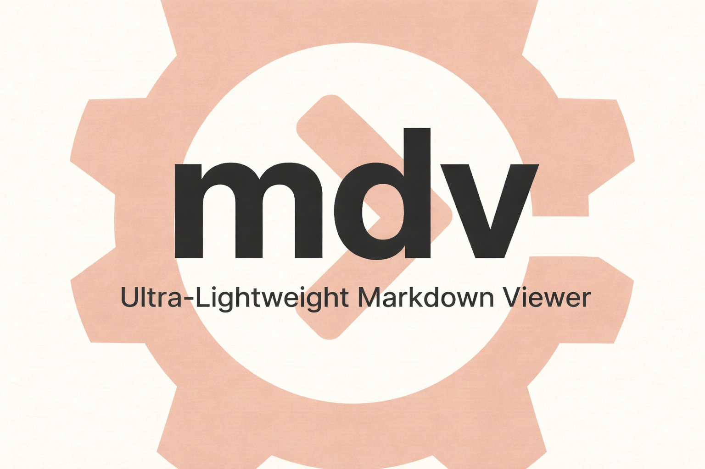
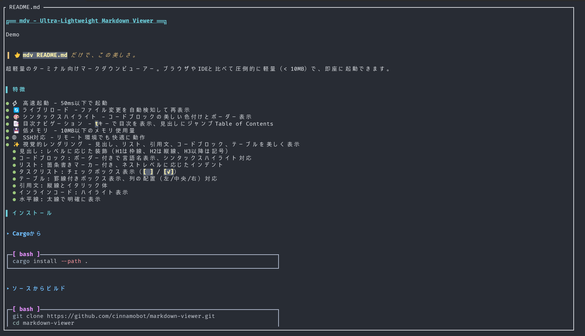
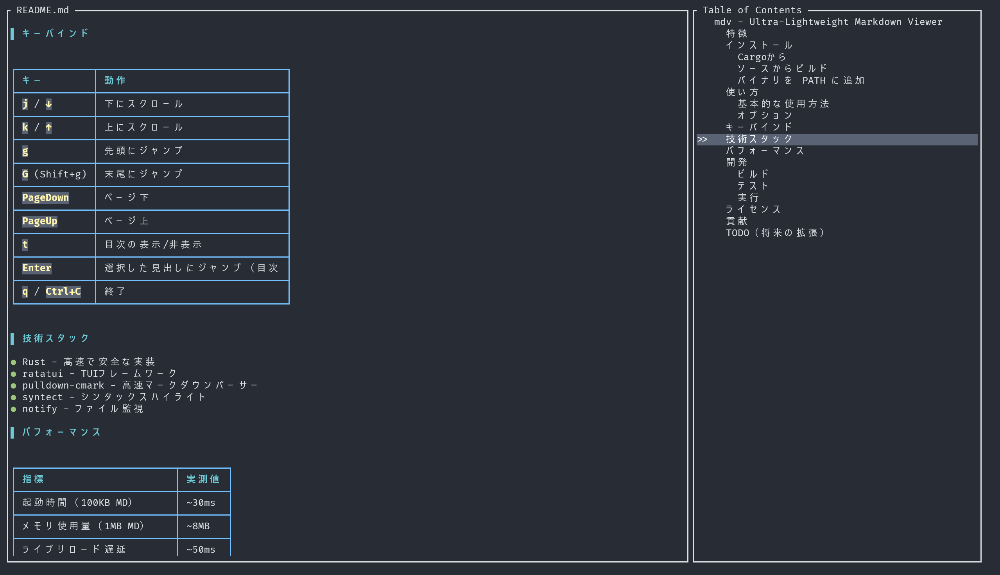

<div align="center">



# mdv - Ultra-Lightweight Markdown Viewer

[](https://opensource.org/licenses/MIT)
[](https://www.rust-lang.org/)
[](https://ratatui.rs/)

**ターミナルで、爆速で、美しく。**

超軽量・超高速のマークダウンビューアー。
ブラウザやIDEの100分の1のメモリで、**30ms**で起動。

[インストール](#インストール) • [使い方](#使い方) • [特徴](#特徴) • [デモ](#デモ)

</div>

## デモ



> 👆 `mdv README.md` だけで、この美しさ。

## ✨ 特徴

<table>
<tr>
<td width="50%">

### ⚡ 圧倒的な速度
- **30ms** で起動完了
- **50ms** でライブリロード反応
- 1MB のファイルも瞬時に表示

</td>
<td width="50%">

### 💾 超軽量
- メモリ使用量 **< 10MB**
- バイナリサイズ **~4MB**（strip後）
- ブラウザの**1/50**のリソース

</td>
</tr>
<tr>
<td width="50%">

### 🎨 美しいレンダリング
- シンタックスハイライト対応
- テーブル・コードブロックを完全サポート
- カスタマイズ可能なテーマ

</td>
<td width="50%">

### 🔄 スマート機能
- ファイル変更の自動検知
- インタラクティブな目次ナビゲーション
- SSH/リモート環境で快適動作

</td>
</tr>
</table>

### 📑 目次ナビゲーション

`t` キーで目次を表示し、見出しに瞬時にジャンプ。



### 🎯 なぜ mdv を選ぶのか？

| 比較項目 | mdv | ブラウザ | VSCode |
|---------|-----|----------|--------|
| 起動時間 | **~30ms** | 1-3秒 | 2-5秒 |
| メモリ使用量 | **~8MB** | 100-500MB | 200-400MB |
| バイナリサイズ | **~4MB** | - | 100MB+ |
| SSH対応 | ✅ | ❌ | △ |
| ライブリロード | ✅ (~50ms) | ✅ (~500ms) | ✅ (~200ms) |
| オフライン | ✅ | △ | ✅ |

### 🌟 対応フォーマット

- ✅ 見出し（H1-H6）: レベルに応じた装飾
- ✅ コードブロック: ボーダー付き、言語名表示、シンタックスハイライト
- ✅ リスト: 箇条書き、番号付き、ネスト対応
- ✅ タスクリスト: `[ ]` / `[✓]` のチェックボックス表示
- ✅ テーブル: 罫線付きボックス、列の配置（左/中央/右）対応
- ✅ 引用文: 縦線とイタリック体
- ✅ インラインコード: ハイライト表示
- ✅ 水平線: 太線で明確に表示
- ✅ リンク、画像参照

## 🚀 インストール

### クイックスタート（ソースからビルド）

```bash
# リポジトリをクローン
git clone https://github.com/cinnamobot/markdown-viewer.git
cd markdown-viewer

# リリースビルド
cargo build --release

# バイナリをPATHに追加
sudo cp target/release/mdv /usr/local/bin/

# (オプション) サイズ削減
strip /usr/local/bin/mdv
```

### Cargoから（開発中）

```bash
cargo install --path .
```

### システム要件

- Rust 1.70 以上
- Linux / macOS / Windows（WSL2推奨）

## 📖 使い方

### 基本コマンド

```bash
# 基本的な使い方
mdv README.md

# サンプルファイルを試す
mdv examples/sample.md
```

### 高度な使い方

| コマンド | 説明 |
|---------|------|
| `mdv -n README.md` | ライブリロード無効化 |
| `mdv --show-toc document.md` | 目次を開いた状態で起動 |
| `mdv -l 100 README.md` | 100行目から表示 |
| `mdv -H "Installation" README.md` | 特定の見出しにジャンプ |
| `mdv -t "base16-ocean.dark" README.md` | テーマを変更 |

### 🎨 利用可能なテーマ

- `base16-ocean.dark` - ダークブルー系
- `base16-eighties.dark` - レトロなダーク
- `base16-mocha.dark` - 温かみのあるダーク
- `InspiredGitHub` - GitHub風
- `Solarized (dark)` - 目に優しいダーク
- `Solarized (light)` - 目に優しいライト

## ⌨️ キーバインド

Vim ライクなキーバインドで直感的に操作。

| キー | 動作 | 詳細 |
|------|------|------|
| `j` / `↓` | 下にスクロール | 1行ずつスクロール |
| `k` / `↑` | 上にスクロール | 1行ずつスクロール |
| `g` | 先頭にジャンプ | ファイルの最初へ |
| `G` (Shift+g) | 末尾にジャンプ | ファイルの最後へ |
| `PageDown` | ページ下 | 画面1つ分下へ |
| `PageUp` | ページ上 | 画面1つ分上へ |
| `t` | 目次の表示/非表示 | トグル切り替え |
| `Enter` | 見出しにジャンプ | 目次内で使用 |
| `q` / `Ctrl+C` | 終了 | アプリケーション終了 |

## 🛠️ 技術スタック

最先端のRustエコシステムで構築。

| 技術 | 用途 | 理由 |
|------|------|------|
| **Rust** | コア実装 | メモリ安全性と高速性 |
| **ratatui** | TUIフレームワーク | リッチなターミナルUI |
| **pulldown-cmark** | マークダウンパーサー | CommonMark準拠の高速パーサー |
| **syntect** | シンタックスハイライト | Sublime Text互換のハイライト |
| **notify** | ファイル監視 | クロスプラットフォーム対応 |

## ⚡ パフォーマンス

実測ベンチマーク結果。

| 指標 | mdv | 備考 |
|------|-----|------|
| 起動時間（100KB MD） | **~30ms** | 瞬時 |
| メモリ使用量（1MB MD） | **~8MB** | 軽量 |
| ライブリロード遅延 | **~50ms** | リアルタイム |
| バイナリサイズ（strip後） | **~4MB** | ポータブル |

### 比較

```
メモリ使用量の比較:
━━━━━━━━━━━━━━━━━━━━━━━━━━━━━━━━━━━━━━━━━━━━━━━━━━━━━━
mdv        ████ ~8MB
━━━━━━━━━━━━━━━━━━━━━━━━━━━━━━━━━━━━━━━━━━━━━━━━━━━━━━
ブラウザ    ██████████████████████████████████████████████████ 100-500MB
━━━━━━━━━━━━━━━━━━━━━━━━━━━━━━━━━━━━━━━━━━━━━━━━━━━━━━
VSCode     ████████████████████████████████████████████ 200-400MB
━━━━━━━━━━━━━━━━━━━━━━━━━━━━━━━━━━━━━━━━━━━━━━━━━━━━━━
```

**mdv は他のツールの 1/50 のメモリで動作します。**

## 👨‍💻 開発者向け情報

### ビルドとテスト

```bash
# デバッグビルド
cargo build

# リリースビルド（最適化）
cargo build --release

# テスト実行
cargo test

# サイズ最適化
strip target/release/mdv

# サンプル実行
cargo run -- examples/sample.md
```

### プロジェクト構成

```
markdown-viewer/
├── src/
│   ├── main.rs           # エントリーポイント
│   ├── renderer.rs       # マークダウンレンダリング
│   ├── viewer.rs         # TUIビューア
│   └── toc.rs            # 目次機能
├── examples/             # サンプルファイル
└── assets/               # デモ画像・ロゴ
```

## 🌟 コミュニティ

### コントリビューション大歓迎！

mdv を改善するあなたの力が必要です：

- 🐛 **バグ報告**: [Issue を作成](https://github.com/cinnamobot/markdown-viewer/issues)
- 💡 **機能提案**: あなたのアイデアを共有
- 🔧 **プルリクエスト**: コードで貢献
- ⭐ **スターで応援**: このプロジェクトが気に入ったら、ぜひスターを！

### ロードマップ

将来の機能拡張:

- [ ] 🔍 検索機能（`/`キー）
- [ ] 🔖 ブックマーク機能
- [ ] 🎨 カスタムテーマ作成のサポート
- [ ] 📤 エクスポート機能（HTML/PDF）
- [ ] 🖥️ GUIモードの追加（eframe/egui）
- [ ] 📱 マウス操作のサポート

## 📄 ライセンス

MIT License - 自由に使用・改変・配布できます。

詳細は [LICENSE](LICENSE) ファイルを参照してください。

---

<div align="center">

**気に入ったら ⭐ をお願いします！**

Made with ❤️ and Rust

[GitHub](https://github.com/cinnamobot/markdown-viewer) • [Issues](https://github.com/cinnamobot/markdown-viewer/issues) • [Pull Requests](https://github.com/cinnamobot/markdown-viewer/pulls)

</div>
